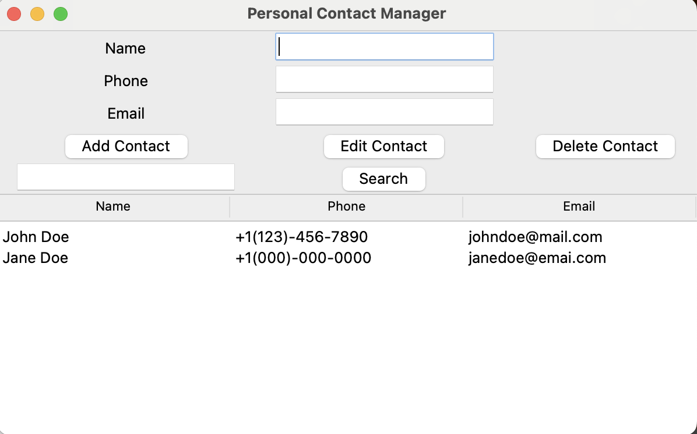

# Personal Contact Manager

Personal Contact Manager with SQLite

## Description
The Personal Contact Manager is a Python application that allows users to manage their contacts efficiently. It provides functionalities to add, edit, delete, and search for contacts stored in an SQLite database. The application features a user-friendly graphical interface built using Tkinter.

## Features
- **Add Contacts**: Users can add new contacts with their name, phone number, and email address.
- **Edit Contacts**: Users can modify existing contact details.
- **Delete Contacts**: Users can remove contacts from the database.
- **Search Functionality**: Users can search for contacts by name or phone number.
- **Display Contacts**: Contacts are displayed in a table format for easy viewing.
- **Data Validation**: Basic validation for email and phone number fields can be implemented.

## Technologies Used
- **Python**: The primary programming language for business logic and SQLite interaction.
- **SQLite**: A lightweight database for storing contact information.
- **Tkinter**: A standard GUI toolkit for creating the graphical interface.

## Screenshot:

<div align="center">
   
</div>

## Installation
1. **Clone the Repository**:
   ```bash
   git clone https://github.com/yourusername/personal_contact_manager.git
   cd personal_contact_manager
   ```

2. **Create and Activate Virtual Environment**:
   Ensure you have Python installed. Create a virtual environment to isolate project dependencies:
   ```bash
   python -m venv venv
   source venv/bin/activate  # On Windows use `venv\Scripts\activate`
   deactivate  # To exit the virtual environment
   ```

3. **Run the Application**:
   Execute the main script to start the application:
   ```bash
   python main.py
   ```

## Usage
1. **Adding a Contact**:
   - Enter the contact's name, phone number, and email in the respective fields.
   - Click the "Add Contact" button to save the contact.

2. **Editing a Contact**:
   - Select a contact from the displayed list.
   - Modify the details in the entry fields.
   - Click the "Edit Contact" button to update the contact.

3. **Deleting a Contact**:
   - Select a contact from the displayed list.
   - Click the "Delete Contact" button to remove the contact.

4. **Searching for Contacts**:
   - Enter a name or phone number in the search field.
   - Click the "Search" button to filter the contacts displayed.

## File Structure
- **main.py**: The main script that runs the application.
- **gui.py**: Contains the Tkinter GUI elements and event handling.
- **database.py**: Handles database operations, including creating the table, adding, editing, deleting, and searching contacts.

## License
This project is licensed under the [MIT License](https://opensource.org/licenses/MIT).